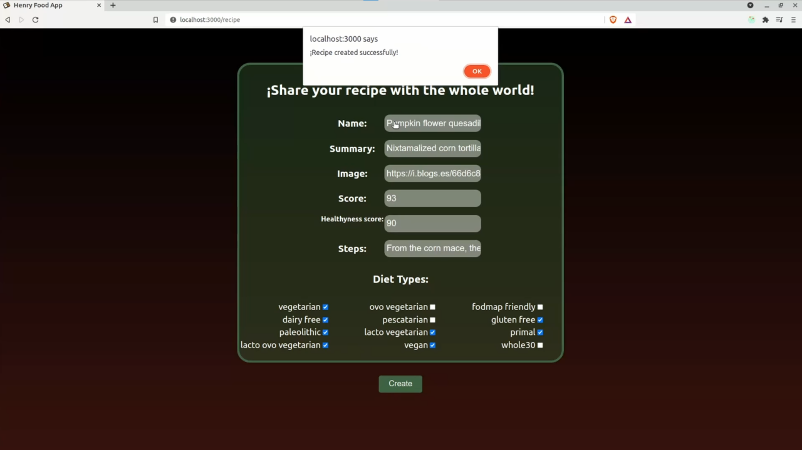

<h1 align="center"> Hi there. 👋 Welcome to my Github profile. </h1>
 

 

<b>I am a Full Stack Web Developer with a PERN (PostgreSQL, Express, ReactJS, NodeJS) profile, a tech enthusiast since Tamagotchi. Since I was little, in computer science class they instilled in me a curiosity for HTML, with which I began to do my first experiments in notepad.

I am currently finishing the Henry bootcamp, where I was able to expand and exercise my technical and social skills as a developer. Previously I was dedicated to social sciences, due to the pandemic, I decided to turn my profession around.

¡I would like us to get in touch!
</b>

 

<a href="https://www.linkedin.com/in/imakheri">  &nbsp;
<a href="https://t.me/Imakheri">  &nbsp;
<a href="https://twitter.com/Imakheri"> 
<h2><a href="mailto:imakheri@gmail.com" >E-mail: imakheri@gmail.com</a></h2>

<h1>Competencies</h1>

<table align="center" style="background-color: #f6f8fa;">
  <tr>
    <td align="center" width="96">
        
       HTML 5
    </td>
    <td align="center" width="96">
        
       CSS 3
    </td>
    <td align="center" width="96">
        
       Javascript
    </td>
    <td align="center" width="96">
        
       ReactJS & React Native
    </td>
    <td align="center" width="96">
        
       Redux
    <td align="center" width="96">
        
       Git & Github
    </td>
  </tr>
    </td>
  <tr align="center">
    <td align="center"  width="96">
        
       TypeScript
    </td>
    <td align="center" width="96">
        
       NodeJS
    </td>
    <td align="center" width="96"> 
        
       ExpressJS
    </td>
    <td align="center" width="96">
        
       Postgresql
    </td>
    <td align="center" width="96">
        
       Postman
    </td>
    <td align="center"  width="96">
        
       npm
    </td>
  </tr>
</table>

<h1>Projects</h1>
<h2>Henry Food App</h2>

The central idea is a cookbook on different dishes from around the world. It was developed with all the technologies learned during the Bootcamp, such as:

• Sequelize - Postgres
• Express
• React.js
• Redux
• CSS

This project was presented and approved on November 11, 2021. We're going for more, bigger challenges are coming!

&nbsp;&nbsp;
&nbsp;&nbsp;
&nbsp;&nbsp;

<!--
**Imakheri/Imakheri** is a ✨ _special_ ✨ repository because its `README.md` (this file) appears on your GitHub profile.

Here are some ideas to get you started:

- 🔭 I’m currently working on ...
- 🌱 I’m currently learning ...
- 👯 I’m looking to collaborate on ...
- 🤔 I’m looking for help with ...
- 💬 Ask me about ...
- 📫 How to reach me: ...
- 😄 Pronouns: ...
- ⚡ Fun fact: ...
-->